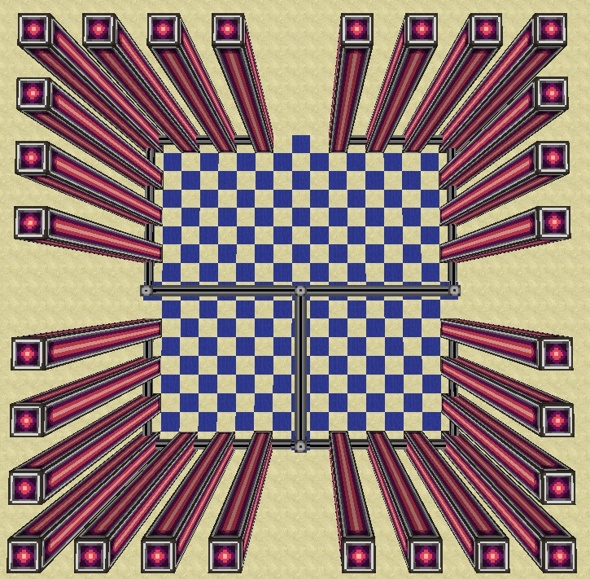

# Holopad
Holopad Minecraft 1.7.10 AE2 Spatial Pylon+CC

# Mi is ez 

Minecraft 1.7.10-ben az [Applied Energistics 2.](http://ae-mod.info/) [Spatial Pylon](http://ae-mod.info/Spatial-Containment-Structure/)-okkal körül határolt területet tudjuk Spatial Storage Cellekbe menteni és utána bármikor előhozni. A vezérlés LUA scyptel [ComputerCraft] (http://www.computercraft.info/) felhasználásával, 7*3-as érintő kijelzőn.

# Felhasznált anyagok
> A * jelölt blokok variálhatok
* ComputerCraft 
	* 21 db Advanced Monitor
	* 1 db Advanced Computer
	* 1 db Wireless Modem
	* 1 db Advanced Wireless Turtle 
* Applied Energistics 2	
	* 1 db ME Controller
	* 2 db Dense Energy Cell 
	* 1 db Spatial IO Port 
	* 256 db Spatial Pylon *
	* 6 db 128-as Spatial Storage Cell *
	* Smart és Dense Cable

# Épités
* Alap helyzetben
	* 19*19-es terület itt helyezzük el a Spatial Pylon-okat 9-es blokk magaságban 
	* össze kötjük az oszlopok alját a képen látható modon 8-as csoportokban sima Smart Cabel-al
	* A Dense Cable lesz a gerinc ehhez csatlakoztatjuk a 4 db 8-as csoport Spatial Pylon-t
	* Csatlakoztatjuk Az ME Controllert a gerinchez a szóbán kivül
	* A controller-hez csatlakoztatjuk a Spatial IO Portot és az Energy Cell-eket
	
	> *A müködéshez szükséges energia 6,48 MRF, ezt 2 db Dense Energi Cell képes biztositani nekünk!*
	
	* A Spatial IO Porthoz tesszük le a Turtle-t
	* Megépitjük a 7*3-as Advanced Monitort
	* Alá tesszük az Advance Computert
	* Az Advanced Computer ball oldalára felrakjuk a Wireless Modemet
	
	> *Ha nem igy helyezzük el a programot modositani kell a személyre szabás pontban olvasható modon!
	
	* A jobb oldalát hagyjuk szabadon
	


> *a kép az elhelyezésről*	
	
* Plusz lehetöség
	* Az Advanced Computer hátulján redstone aktiv redstone jell jön ki amig a szoba be van töltve, erre akár tehetünk egy redstone jel küldöt amit ráköthetünk akár egy ajtora hogy amikor egy szoba aktív kinyiljon, amikor pedig éppen nem aktiv legyen csukva, ez persze nem kötelező!
	
# Programok telepítése
* Computer telepítés
```
> label set Holopad
> pastebin get SYmv2GYZ install
> install
```
* Turtle telepítése
```
> label set Rednet
> pastebin get bwGkEmHx startup
> install
```
# Program futtatás
A computerben és a turtle-ben is "startup" parancsal indithatok a programok, alap esetben automatikusan elindulnak

# Személyre szabás
```
>edit startup
```
* ha más pozicioban van elhelyezve a monitor vagy a wireless modem a fentiekhez képest az alábi sorokat kell tetszölegessen modositani	
	
	```
	>buttons = touchpoint.new ("monitor iránya esetleg a monitor megnevezése") 
	>close = touchpoint.new ("monitor iránya esetleg a monitor megnevezése") 
	>loading = touchpoint.new ("monitor iránya esetleg a monitor megnevezése") 
	>t = touchpoint.new ("monitor iránya esetleg a monitor megnevezése") 
	>mon = peripheral.wrap ("monitor iránya esetleg a monitor megnevezése") 
	>t = touchpoint.new ("monitor iránya esetleg a monitor megnevezése") 
	>rednet.open ("Wireless Modem helye nem lehet hátul és jobb oldalt!!")
	```
		
* 6 szóbának van hely ezeket az alábbi sorokat modosítva nevezhetjük át
		
	```
	>r1 = "szoba név megadása"
	>r2 = "szoba név megadása"
	>r3 = "szoba név megadása" 
	>r4 = "szoba név megadása"
	>r5 = "szoba név megadása"
	>r6 = "szoba név megadása" 
	```
	
