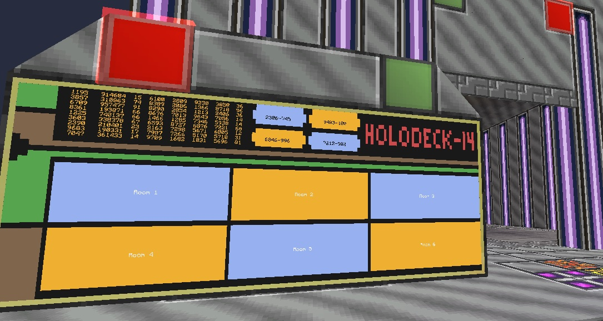
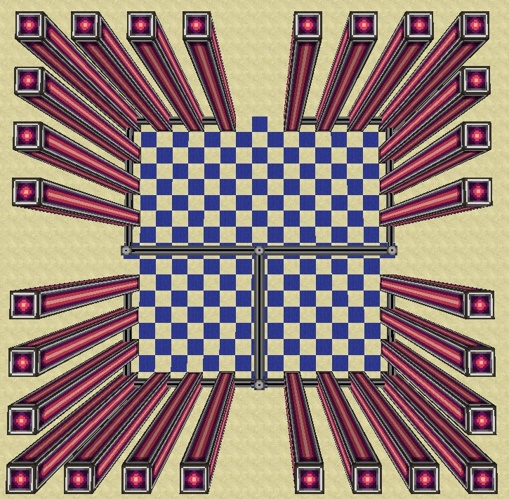

# Holopad
Holopad Minecraft 1.7.10 AE2 Spatial Pylon+CC



# Mi is ez 

Minecraft 1.7.10-ben az [Applied Energistics 2.](http://ae-mod.info/) [Spatial Pylon](http://ae-mod.info/Spatial-Containment-Structure/)-okkal körül határolt területet tudjuk Spatial Storage Cellekbe menteni és utána bármikor előhozni. A vezérlés LUA scyptel [ComputerCraft] (http://www.computercraft.info/) felhasználásával, 7*3-as érintő kijelzőn.

# Felhasznált anyagok

* ComputerCraft 
	* 21 db Advanced Monitor
	* 1 db Advanced Computer
	* 1 db Wireless Modem
	* 1 db Advanced Wireless Turtle 
* Applied Energistics 2	
	* 1 db ME Controller
	* 2 db Dense Energy Cell 
	* 1 db Spatial IO Port 
	* 252 db Spatial Pylon *
	* 6 db 128-as Spatial Storage Cell *
	* Smart és Dense Cable
```
A * jelölt blokkok variálhatok 
```

# Építés
* Alap helyzetben (maximális méret)
	* 17*17 terület, itt helyezzük el a Spatial Pylon-okat 9-es blokk magaságban 
	* össze kötjük az oszlopok alját a képen látható módon 8-as csoportokban sima Smart Cabel-al
	* a Dense Cable lesz a gerinc ehhez csatlakoztatjuk a 4 db 8-as csoport Spatial Pylon-t
	* csatlakoztatjuk Az ME Controllert a gerinchez a szóbán kívül
	* a kontrollerhez csatlakoztatjuk a Spatial IO Portot és az Energy Cell-eket
	
	> *A működéshez szükséges energia 6,48 MRF, ezt 2 db Dense Energi Cell képes biztositani nekünk!*
	
	* a Spatial IO Porthoz tesszük le a Turtle-t
	* megépítjük a 7*3-as Advanced Monitort
	* alá tesszük az Advance Computert
	* az Advanced Computer ball oldalára felrakjuk a Wireless Modemet
	
	> *Ha nem igy helyezzük el a programot módosítani kell,  a személyre szabás  pontban olvasható módon!
	
	* az Advanced Computer jobb oldalát hagyjuk szabadon
	


> *a kép az elhelyezésről*	
	
* Plusz lehetőség
	* Az Advanced Computer hátulján redstone aktív redstone jel jön ki, amig a szoba be van töltve egy szoba, erre akár tehetünk egy redstone jel küldöt amit ráköthetünk egy ajtóra, hogy amikor egy szoba aktív kinyíljon, amikor pedig nem aktív legyen csukva, ez persze nem kötelező!
	
# Programok telepítése
* Computer telepítés
```
> label set Holopad
> pastebin get SYmv2GYZ install
> install
```
* Turtle telepítése
```
> label set Rednet
> pastebin get bwGkEmHx startup
> install
```
# Program futtatás/Leállítása
* A computerben és a turtle-ben is "startup" paranccsal indíthatok a programok, alap esetben automatikusan elindulnak. 
* Leállítani a "CTRL+T" nyomva tartásával szakíthatok meg.

# Program használata 
* Szoba létrehozás
	* kiválasztjuk a helyet a kijelzőn 
	* click a kiválasztot gombon
	* megvárjuk míg betölt "Loading"
	* megjelenik a "Close" felirat már a Cell a helyén van 
	* most már építkezhetünk a Pylonokkal határolt területen
	
	> *nem minden módot kezel sajnos*
	
	* ha úgy érezzük kész vagyunk akkor click a "Close" feliratra és már el is menetük
	* a szoba nevének módosítása a személyre szabásnál olvasható 

# Személyre szabás
```
>edit startup
```
* ha más pozícióban van elhelyezve a monitor vagy a wireless modem a fentiekhez képest az alábbi sorokat kell tetszőlegesen módosítani	
	
	```
	>buttons = touchpoint.new ("monitor iránya esetleg a monitor megnevezése") 
	>close = touchpoint.new ("monitor iránya esetleg a monitor megnevezése") 
	>loading = touchpoint.new ("monitor iránya esetleg a monitor megnevezése") 
	>t = touchpoint.new ("monitor iránya esetleg a monitor megnevezése") 
	>mon = peripheral.wrap ("monitor iránya esetleg a monitor megnevezése") 
	>t = touchpoint.new ("monitor iránya esetleg a monitor megnevezése") 
	>rednet.open ("Wireless Modem helye nem lehet hátul és jobb oldalt!!")
	```
		
* 6 szóbának van hely ezeket az alábbi sorokat módosítva nevezhetjük át
		
	```
	>r1 = "szoba név megadása"
	>r2 = "szoba név megadása"
	>r3 = "szoba név megadása" 
	>r4 = "szoba név megadása"
	>r5 = "szoba név megadása"
	>r6 = "szoba név megadása" 
	```
	
# Program frissítése
* jobb click a computeren 
* nyomva tartjuk a CTRL+T a kurzort megjelenése után az alábbiakat írjuk be `>`

```
> install
> startup
```

[English](http://)
